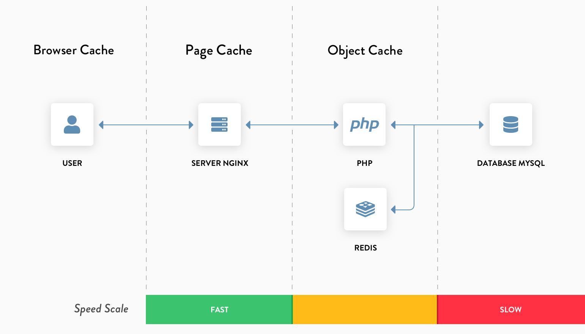
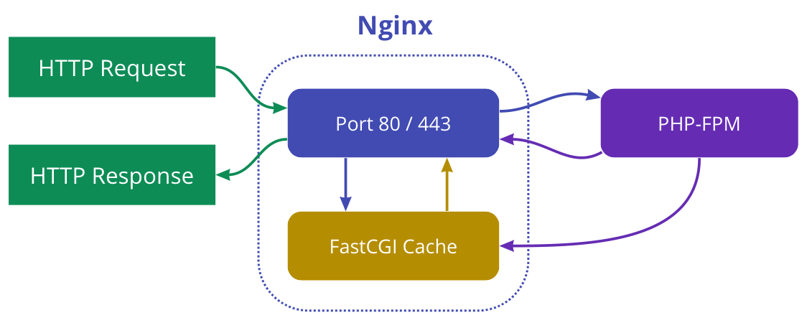
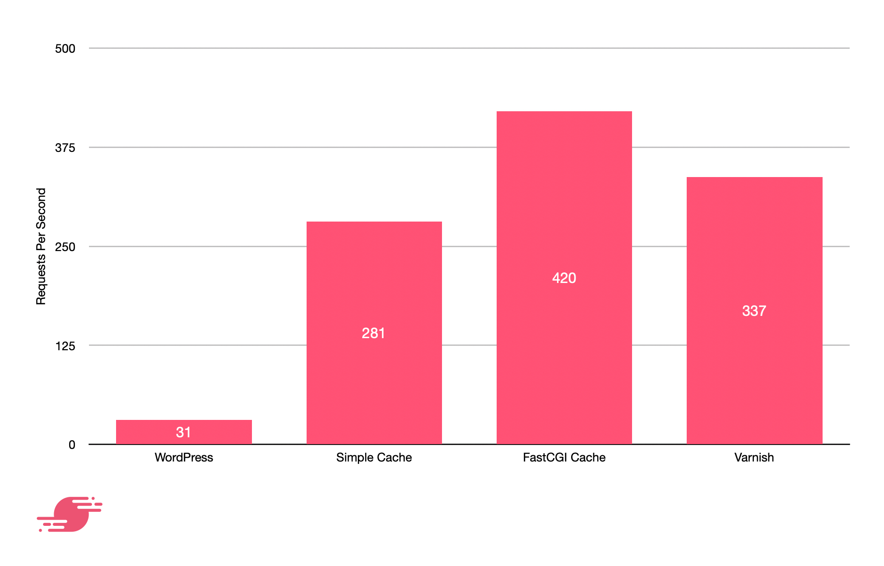
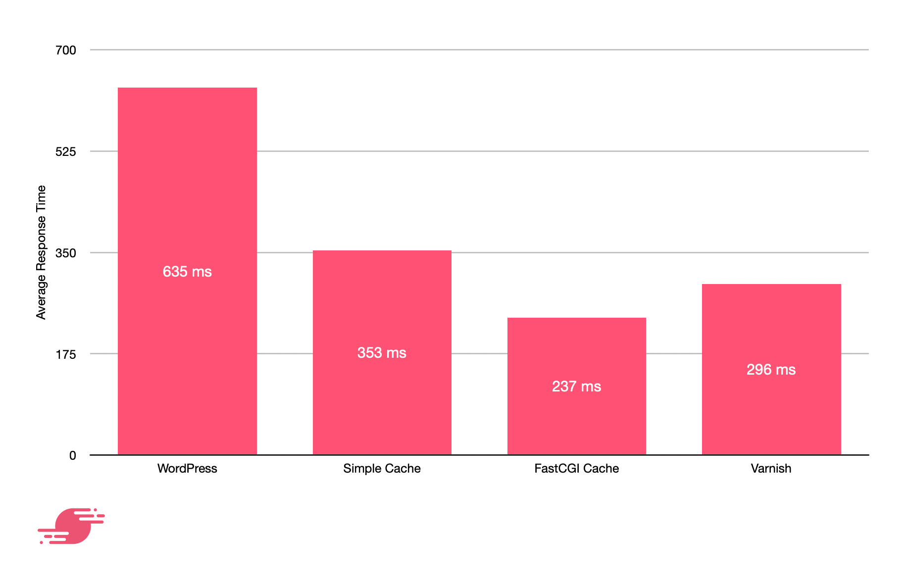

# Cacheable PHP Enviroment

### How it work

Simple Cache – Caching via a WordPress plugin

### Page Cache

### Requests per second

### Average response time

## TODOS

- [x] maintain nginx plugins to support this feature
    - [ngx_cache_purge](https://github.com/chet-cloud/ngx_cache_purge)

- [x] maintain and development a docker images as the php cacheable envorioment in azure
    - [artisreit_wordpress](https://github.com/chet-cloud/artisreit_wordpress)
    - integrate the enviroment with `Azure App Server`

- [ ] Pressure testing
    - set up projects for pressure test
    - using `ab` - Apache HTTP server benchmarking tool

- [ ] Test the cache config in nginx

- [ ] Test the wordpress running in cache enviroment
