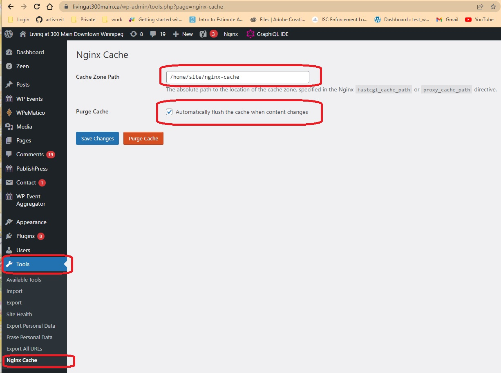

# Cacheable PHP Enviroment


### How it work


### Open Cache in nginx configuration

```shell
# display the nginx config files for different websites 
ls /home/site/deployments/nginx/sites-enabled/

# 300main.ca  601carlson.com  artisplayground  artisreit.com  default  madison.artisreit.com

# default is default file for the wordpress websits
server {
    include include/exclusions.conf;
    include include/security.conf;
    # 0 - turn on cache; 1 - turn off cache
    set $skip_cache 0;
    include include/site.conf;
    server_name ~^(.+)$;
}

```

- set $skip_cache 0; means the cache is opened by default for wordpress websites


### Cache setting in nginx configuration
```shell
# display the nginx cache setting config files 
    ls /home/site/deployments/nginx/include/cache*

# /home/site/deployments/nginx/include/cache-path.conf 
    fastcgi_cache_path /home/site/nginx-cache levels=1:2 keys_zone=WORDPRESS:100m inactive=60y;

# /home/site/deployments/nginx/include/cache-setting.conf
    fastcgi_cache_bypass $skip_cache;
    fastcgi_no_cache $skip_cache;
    fastcgi_cache WORDPRESS;
    fastcgi_cache_valid 60y;

# /home/site/deployments/nginx/include/cache-rules.conf
    fastcgi_cache_key "$scheme$request_method$host$request_uri";
    fastcgi_cache_use_stale error timeout updating invalid_header http_500;
    fastcgi_ignore_headers Cache-Control Expires Set-Cookie;
    add_header Fastcgi-Cache $upstream_cache_status;
    if ($request_method = POST) {
        set $skip_cache 1;
    }
    if ($query_string != "") {
        set $skip_cache 1;
    }
    if ($request_uri ~* "/wp-admin/|/wp-json/|/xmlrpc.php|wp-.*.php|/feed/|index.php|sitemap(_index)?.xml|/cart/|/checkout/|/my-account/") {
        set $skip_cache 1;
    }

```

- `60y is 60 years`, means the cache files is available forever unless remove them.
- the cache files path is `/home/site/nginx-cache`
- when the nginx start, the nginx instance will load the caches fils in that path. If the cache is turn on, removing the cache file is the only way to purge the cache.
- Fastcgi-Cache - the cache only works for the php pages. 


### purge the cache automatically

- install the plugin for cache purge
```shell
# Install Nginx Cache and set cache path -  /home/site/nginx-cache
curl -O https://raw.githubusercontent.com/wp-cli/builds/gh-pages/phar/wp-cli.phar && chmod +x wp-cli.phar && mv wp-cli.phar /usr/local/bin/wp && cd /home/site/wwwroot/
cd /home/site/wwwroot/ && wp plugin install 'Nginx Cache' --allow-root &&
cd /home/site/wwwroot/ && wp plugin activate 'nginx-cache' --allow-root
```
- set the plugin




- when there is a update or publish action, the plugin will purge all the cache files in `/home/site/nginx-cache`

- TODO 

    1. need to install a nginx module - https://nginx-extras.getpagespeed.com/modules/cache-purge/

        - this nginx module can purge a page item by URL, that means when there is a update, only remove the updated pages, no need to purge the whole cached files.

    2. need to maintain a nginx with cache-purge module, because the nginx in azure don't support it. 

