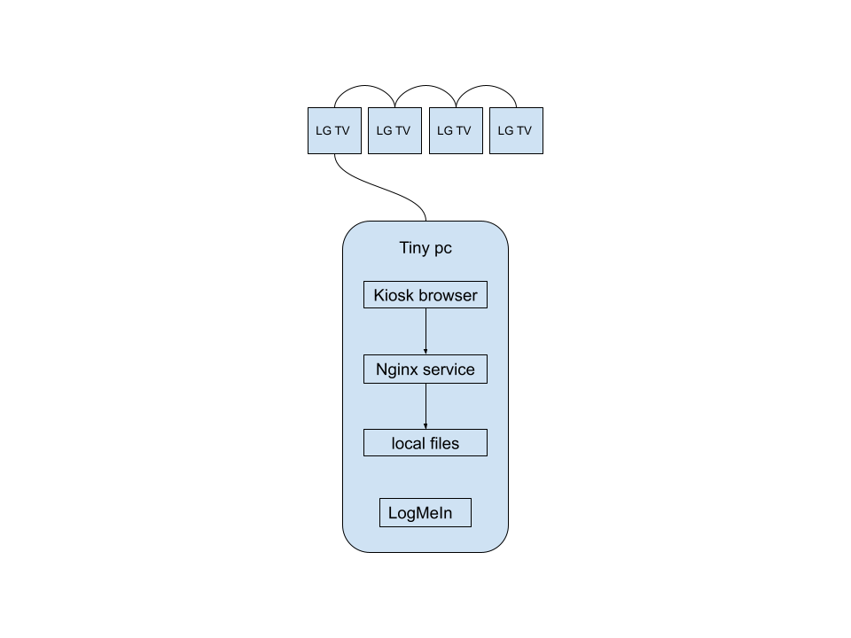
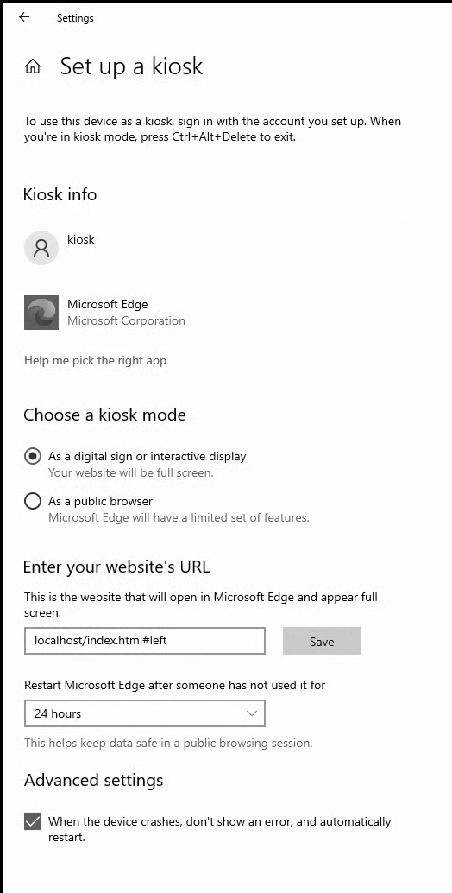
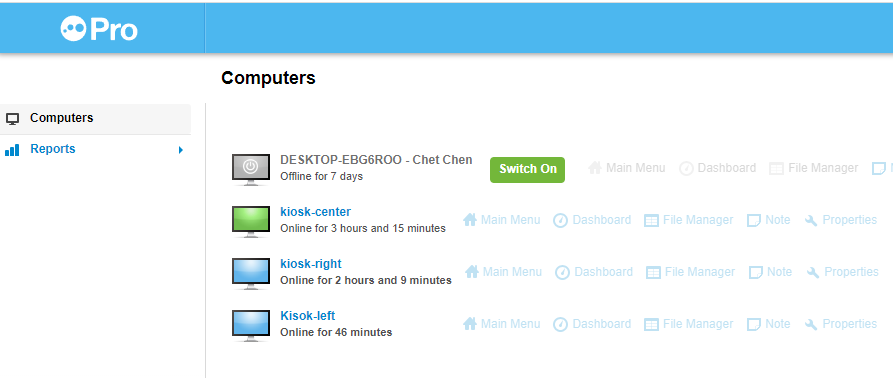

# Kiosk project


### Requirement

1. Display the contents in multiple displays at the same time

2. The content can be updated by non-developers

3. Window system - mini PC server the content and kiosk

4. Figure out a way to transit the video without interruption

5. Figure out a system to display the videos (a loop of video?)

6. Handle when videos are too big and are delaying

7. Might add motion detector in the future for interaction with kiosk


### Hardware

- Tiny pcs
    * thinkcentre M93p - Pro windows8
    * thinkcentre M73 - Pro windows
    * thinkcentre M700 - Pro windows  - deploying nodejs server


### Solution




### Explaining

1. LG TV support "TV WALL" - combined TVs as one screen display one signal line from one tiny pc

2. Kiosk mode
    - Tiny pc, installed window 10 pro, supports [kiosk mode](https://docs.microsoft.com/en-us/windows/configuration/setup-digital-signage)

3. Nginx service
    - Nginx, stylized as NGIИX, is a web server that can also be used as a reverse proxy, load balancer, mail proxy and HTTP cache
    - [Win-nginx-service](https://github.com/chet-cloud/win-nginx-service) - running nginx as a service in window
    - When extending the project, the Nginx reverse proxy can be used to connect the services in Azure.
    - High available but require very little CPU and memory resource

4. Local files
    - Local files in C:/Sync is a repo, cloned from github - [300main_kiosk_static](https://github.com/chet-cloud/300main_kiosk_static)

5. LogMeIn
    - Is a remote manager service from IT team
    - Used to remote update local files or other maintain working
    - Press `normal reboot` button in LogMeIn to restart tiny pc 


### Deployment

1. Install nginx
    - install nginx serivce according to the readme in [Win-nginx-service](https://github.com/chet-cloud/win-nginx-service)
    - set the content directory in C:\nginx\conf
    ```shell
        server {
        listen       80;
        server_name  localhost;
        location / {
            root   C:/Sync;
            index  index.html index.htm;
        }

    ```

2. Setup kiosk user

    
    - Kiosk mode - as a digital sign or interactive display
    - website URL - localhost/index.html#left, localhost/index.html#right or localhost/index.html#center 
    - #left, #right or #center as the param pass to determine which page will be displayed
    - every 24 hours restart the browser

3. Install LogMeIn
    - 

### Content Update

1. Update resource files

    - 100M is the max file that can be upload to github, so update the html, css, and js to [300main_kiosk_static](https://github.com/chet-cloud/300main_kiosk_static)
    - copy images and videos to the directory (c:/Sync) in tiny pcs

2. Pull from github

    - go to c:/Sync and run `git pull`
    - update the config file in `core/version.center.json`, `core/version.center.json` or `core/version.center.json`, the browser page will update with new content
