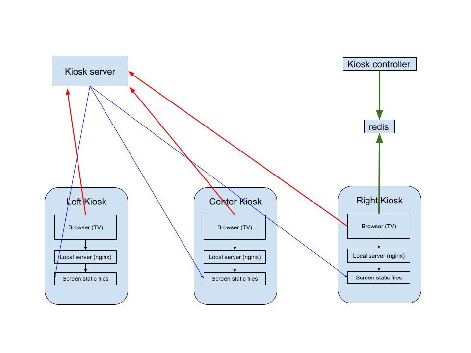

# Kiosk project


### Requirement

1. Display the contents in multiple displays at the same time

2. The content can be updated by non-developers

3. Window system - mini PC server the content and kiosk

4. Figure out a way to transit the video without interruption

5. Figure out a system to display the videos (a loop of video?)

6. Handle when videos are too big and are delaying

7. Might add motion detector in the future for interaction with kiosk


### Hardware

- Tiny pcs
    * thinkcentre M93p - Pro windows8
    * thinkcentre M73 - Pro windows
    * thinkcentre M700 - Pro windows 

### kiosk project

- kiosk server (https://github.com/chet-cloud/kiosk)[https://github.com/chet-cloud/kiosk]

  1. This is a nodejs project containning a front-end sub-project - screens. The screen project is webpack prject will generate the static files for the TV screen when running the command `npm run build `

  2. `center.html`, `left.html` and `right.html` are the generated html for the screens in the `public` directory.
   
  3. After generating the files, run `npm run dev` start the server.  
   
  4. Open http://localhost:8080/left.html to view the TV screen.


- kiosk controller (https://github.com/chet-cloud/kiosk_controller)[https://github.com/chet-cloud/kiosk_controller]

  1. This is a nextjs project used to generate the pure static file as a controller for the right kiosk tv
   

### Solution



1. Browser is used to display the content - playing the videos in loop
2. Browser can access the local server in tiny pc to speed up the loading videos, however if there is no correct video to load in local server, the browser will load the video from remote server - kiosk server
3. If there is no videos directory in local server, the browser will play the videos from kiosk server and may stuck when loading the videos.
4. when upload the new videos to kiosk server, the new video will copied to the every `screen static files` by winscp service
5. when the kiosk server update - the content in public directory changes, the new files - html, css, js will be copied to every `screen static files` by winscp service
6. The right kiosk browser can login kiosk server and access the redis by kisok server, then pulling the commands from redis
7. the kiosk controller can login kiosk server and send the commands to the redis


### Explaining

1. LG TV support "TV WALL" - combined TVs as one screen display one signal line from one tiny pc

2. Kiosk mode
    - Tiny pc, installed window 10 pro, supports [kiosk mode](https://docs.microsoft.com/en-us/windows/configuration/setup-digital-signage)

3. Nginx service
    - Nginx, stylized as NGIИX, is a web server that can also be used as a reverse proxy, load balancer, mail proxy and HTTP cache
    - [Win-nginx-service](https://github.com/chet-cloud/win-nginx-service) - running nginx as a service in window
    - When extending the project, the Nginx reverse proxy can be used to connect the services in Azure.
    - High available but require very little CPU and memory resource

4. Local files
    - Local files in C:/Sync is a repo, cloned a directory `(/site/wwwroot/public)` from the disk of [Kiosk azure web application](https://portal.azure.com/#@artisreit.com/resource/subscriptions/49819368-15a4-45bb-9f47-cbf29f7d8aaa/resourceGroups/Websites/providers/Microsoft.Web/sites/kioskareit/vstscd) 

5. LogMeIn (or install [google remote desktop](https://remotedesktop.google.com/))
    - Is a remote manager service from IT team
    - Used to remote update local files or other maintain working
    - Press `normal reboot` button in LogMeIn to restart tiny pc 


### Deployment

1. Install nginx
    - install nginx serivce according to the readme in [Win-nginx-service](https://github.com/chet-cloud/win-nginx-service)
    - set the content directory in C:\nginx\conf
    ```shell
        server {
        listen       80;
        server_name  localhost;
        location / {
            root   C:/Sync;
            index  index.html index.htm;
        }

    ```

2. Setup kiosk user

    
    - Kiosk mode - as a digital sign or interactive display
    - website URL - localhost/index.html#left, localhost/index.html#right or localhost/index.html#center 
    - #left, #right or #center as the param pass to determine which page will be displayed
    - every 24 hours restart the browser

3. Install LogMeIn or google remote desktop
    - 


4. install winscp as a window service
   
   check out the instructions - [https://github.com/chet-cloud/win-service-winscp](https://github.com/chet-cloud/win-service-winscp)


