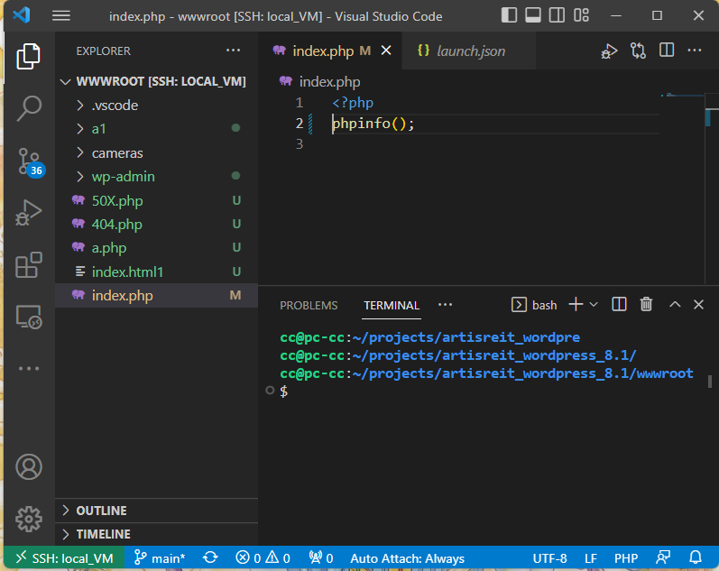
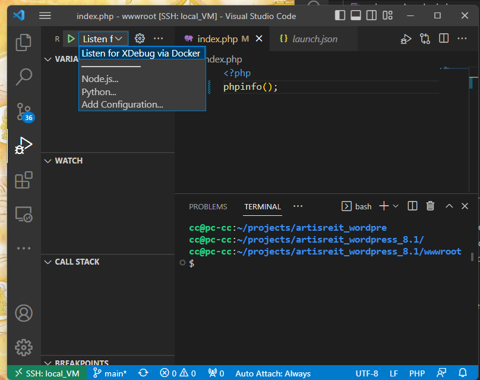
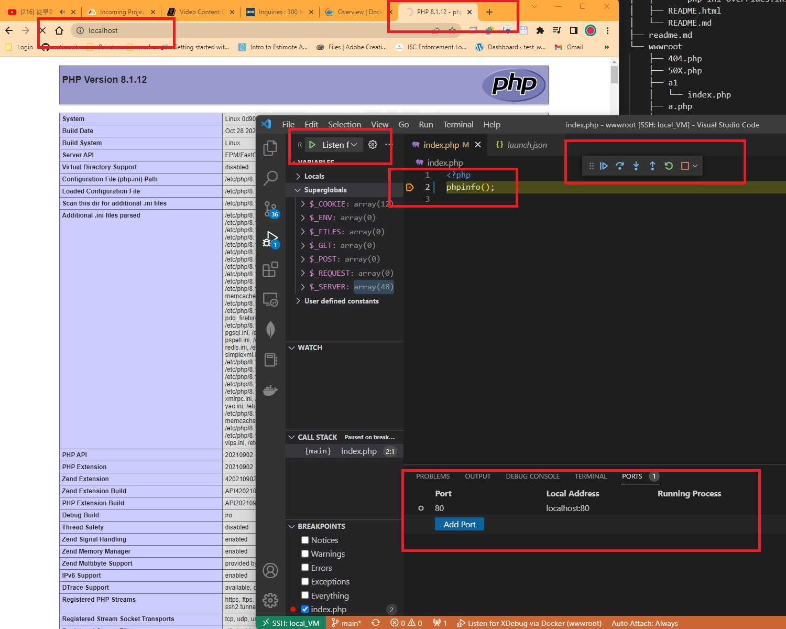

## Requirement for the environment

1. `docker-compose`

 - check out how to install docker-compose - https://docs.docker.com/compose/install/

2. vscode


## Set up the environment

1. clone the project for github
```shell
git clone --depth=1 https://github.com/chet-cloud/artisreit_wordpress_8.1.git
```

2. start the docker-container containing nginx 1.22.1 and php 8.1
```shell
# cd artisreit_wordpress_8.1 - go to the root of the clone project, run:
docker-compose rm -f && docker-compose up
```
The output:
```shell
cc@pc-cc:~/projects/artisreit_wordpress_8.1$ sudo docker-compose rm -f && sudo docker-compose up
[sudo] password for cc: 
Going to remove artisreit_wordpress_81_webserver_1, artisreit_wordpress_81_php-fpm_1
Removing artisreit_wordpress_81_webserver_1 ... done
Removing artisreit_wordpress_81_php-fpm_1   ... done
Creating artisreit_wordpress_81_webserver_1 ... done
Creating artisreit_wordpress_81_php-fpm_1   ... done
Attaching to artisreit_wordpress_81_php-fpm_1, artisreit_wordpress_81_webserver_1
webserver_1  | /docker-entrypoint.sh: /docker-entrypoint.d/ is not empty, will attempt to perform configuration
webserver_1  | /docker-entrypoint.sh: Looking for shell scripts in /docker-entrypoint.d/
webserver_1  | /docker-entrypoint.sh: Launching /docker-entrypoint.d/10-listen-on-ipv6-by-default.sh
webserver_1  | 10-listen-on-ipv6-by-default.sh: info: /etc/nginx/conf.d/default.conf is not a file or does not exist
webserver_1  | /docker-entrypoint.sh: Launching /docker-entrypoint.d/20-envsubst-on-templates.sh
webserver_1  | /docker-entrypoint.sh: Launching /docker-entrypoint.d/30-tune-worker-processes.sh
webserver_1  | /docker-entrypoint.sh: Configuration complete; ready for start up
php-fpm_1    | Created directory: /var/lib/snmp/cert_indexes
php-fpm_1    | [29-Nov-2022 22:30:33] NOTICE: fpm is running, pid 1
php-fpm_1    | [29-Nov-2022 22:30:33] NOTICE: ready to handle connections
php-fpm_1    | [29-Nov-2022 22:30:33] NOTICE: systemd monitor interval set to 10000ms
php-fpm_1    | NOTICE: PHP message: Xdebug: [Step Debug] Could not connect to debugging client. Tried: :9003 (from REMOTE_ADDR HTTP header), 172.19.0.1:9003 (fallback through xdebug.client_host/xdebug.client_port) :-(
php-fpm_1    | 172.25.0.3 -  29/Nov/2022:22:34:47 +0000 "GET /index.php" 200
php-fpm_1    | NOTICE: PHP message: Xdebug: [Step Debug] Could not connect to debugging client. Tried: :9003 (from REMOTE_ADDR HTTP header), 172.19.0.1:9003 (fallback through xdebug.client_host/xdebug.client_port) :-(
php-fpm_1    | 172.25.0.3 -  29/Nov/2022:22:34:52 +0000 "GET /a/index.php" 200
php-fpm_1    | NOTICE: PHP message: Xdebug: [Step Debug] Could not connect to debugging client. Tried: :9003 (from REMOTE_ADDR HTTP header), 172.19.0.1:9003 (fallback through xdebug.client_host/xdebug.client_port) :-(
php-fpm_1    | 172.25.0.3 -  29/Nov/2022:22:35:11 +0000 "GET /a.php" 200
php-fpm_1    | NOTICE: PHP message: Xdebug: [Step Debug] Could not connect to debugging client. Tried: :9003 (from REMOTE_ADDR HTTP header), 172.19.0.1:9003 (fallback through xdebug.client_host/xdebug.client_port) :-(
php-fpm_1    | 172.25.0.3 -  29/Nov/2022:22:35:12 +0000 "GET /a.php" 200
...
```

## Files of the project
```shell
.
├── docker-compose.yml
├── logs                                    ---> the nginx logs directory
│   ├── access.log
│   └── error.log
├── nginx                                   ---> the nginx config files 
│   ├── include
│   │   ├── cache-path.conf
│   │   ├── cache-rules.conf
│   │   ├── cache-setting.conf
│   │   ├── exclusions.conf
│   │   ├── fastcgi-params.conf
│   │   ├── gzip.conf
│   │   ├── http.conf
│   │   ├── limits.conf
│   │   ├── mime-types.conf
│   │   ├── proxy-params.conf
│   │   ├── security.conf
│   │   ├── site.conf
│   │   ├── site-php.conf
│   │   ├── ssl.conf
│   │   └── static-files.conf
│   ├── nginx.conf
│   ├── sites-available
│   ├── sites-enabled
│   │   ├── 601carlson.com
│   │   ├── artisplayground
│   │   ├── artisreit.com
│   │   ├── default
│   │   └── madison.artisreit.com
│   ├── start.sh
│   └── wp
│       ├── 300main.ca.conf
│       ├── artisplayground.conf
│       ├── artisreit.com.conf
│       └── madison.artisreit.com.conf
├── nginx-cache                              ---> the nginx cache
├── phpdocker                                ---> the php docker make script
│   ├── php-fpm
│   │   ├── Dockerfile
│   │   └── php-ini-overrides.ini
│   ├── README.html
│   └── README.md
├── readme.md
└── wwwroot                                ---> the php files directory to serve
    ├── 404.php
    ├── 50X.php
    ├── a1
    │   └── index.php
    ├── a.php
    ├── cameras
    │   └── index.html
    ├── index.html1
    ├── index.php
    └── wp-admin
        └── index.php
```

## open wwwroot with vscode
- open wwwroot with vscode


- open debuger


- forward the port and open the page
