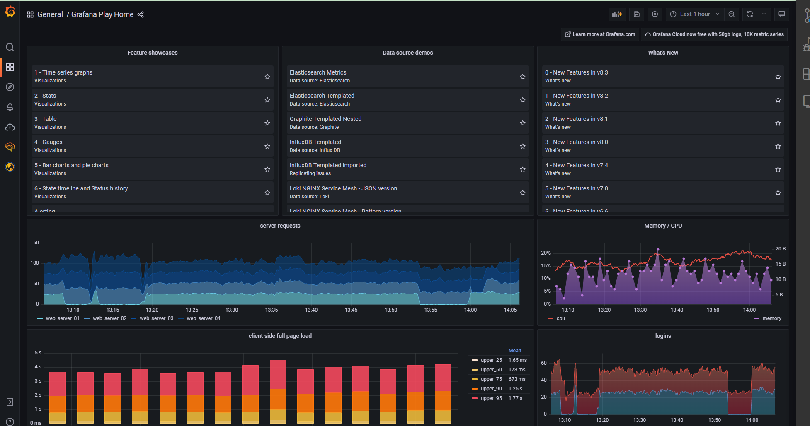

# Monitor

We know some information from google and some third-party service by embedding js in the web pages. Sometimes this information has latency and based on the websites are available.

Requirement:
1. The whole system and all websites needs to be monitored in one place. 
2. The admin can be alerted immediately when the website goes down or some resource exhaustion happens. 
3. Developers need enough information to locate bugs and some areas for improvement.
4. We need to inspect the inner of our website and services.

## TODOS

- [ ] set up nginx-prometheus-exporter in every nginx environment.
- [ ] set up grafana serviece.
- [ ] add database qurey monitor
- [ ] add system invoke monitor
- [ ] integrated with azure[^note]

[^note]: After migration to the Azure static web app, the monitor work can be reduced. The web static website has high available