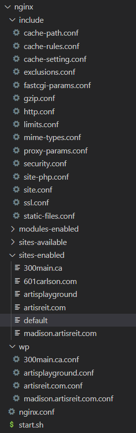

# Install


- Set Startup Command:
```shell
/home/site/deployments/nginx/start.sh
```

- Run the following scripts in SSH to finish install 
```shell
# Install Nginx configration files
apt install git -y &&
rm -rf /tmp/php8_wp_nginx_config &&
git clone --depth=1 https://[github_key_for_deployment]@github.com/chet-cloud/php8_wp_nginx_config.git /tmp/php8_wp_nginx_config && 
rm -rf /home/site/deployments/nginx && 
rm -rf /home/site/nginx-cache/ && 
cp -rf /tmp/php8_wp_nginx_config/nginx /home/site/deployments &&
/home/site/deployments/nginx/start.sh

# Install required plugins and set cache path -  /home/site/nginx-cache
curl -O https://raw.githubusercontent.com/wp-cli/builds/gh-pages/phar/wp-cli.phar && chmod +x wp-cli.phar && mv wp-cli.phar /usr/local/bin/wp && cd /home/site/wwwroot/
cd /home/site/wwwroot/ && wp plugin install 'Nginx Cache' --allow-root &&
cd /home/site/wwwroot/ && wp plugin activate 'nginx-cache' --allow-root &&
cd /home/site/wwwroot/ && wp plugin install 'Multiple Domain' --activate --allow-root &&
cd /home/site/wwwroot/ && wp plugin activate 'multiple-domain' --allow-root

```

## files of the configuration




- https://github.com/chet-cloud/php8_wp_nginx_config
- The scripts clone the nginx files and put them in `/home/site/deployments/nginx`, then reload the config for nginx
- everytime when the web application start, then configuration in in `/home/site/deployments/nginx` will be copied to `/etc/nginx/` 
- in `sites-enabled` directory, the default file will used for the website that don't have a special config. default is used for wordpress websites.
- For exmaple, 300main.ca is a special config file for website - 300main.ca, there are different rules for 300main from default file
- the cache is turn on by defaut in default. checkout the part c2_1-cacheable_php_enviroment - https://chet-cloud.github.io/artisreit_dev_doc/c2_1-cacheable_php_enviroment.html


## online test config

https://nginx-playground.wizardzines.com/


## simulate environment for test

 https://github.com/chet-cloud/artisreit_wordpress_8.1

- this is a docker-composed project which contain nginx 1.22.1 and fast-cgi for php
- the php support xdubgger in vscode.


## collection all htaccess files
```shell
for i in $(find .  -name '.htaccess'); do       echo -e "\n===============> ${i} \n" >>  htaccess.log  ;     cat $i >> htaccess.log ; done ;
```