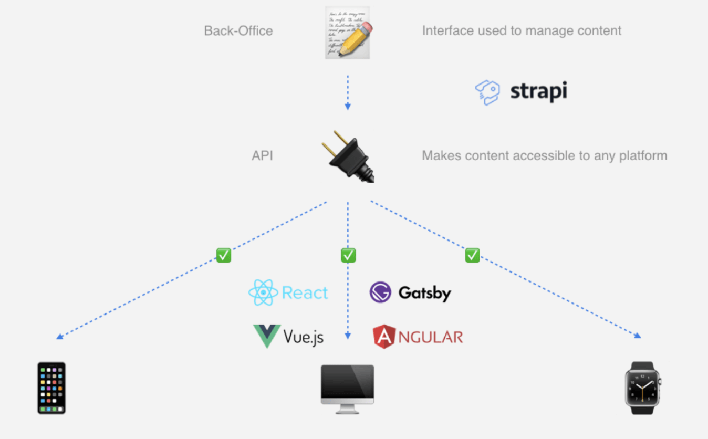

# Strapi

Strapi is a CMS that used to replace WordPress in artisreit. Every one website needs a strapi, but actually, all websites can have one data source (one strapi instance) if we can organize the data together. 

One data source reduces the content manager's work.

## TODOS
- [ ] organize the data from all websites, create new models to save the data.
- [ ] set up a strapi docker service.