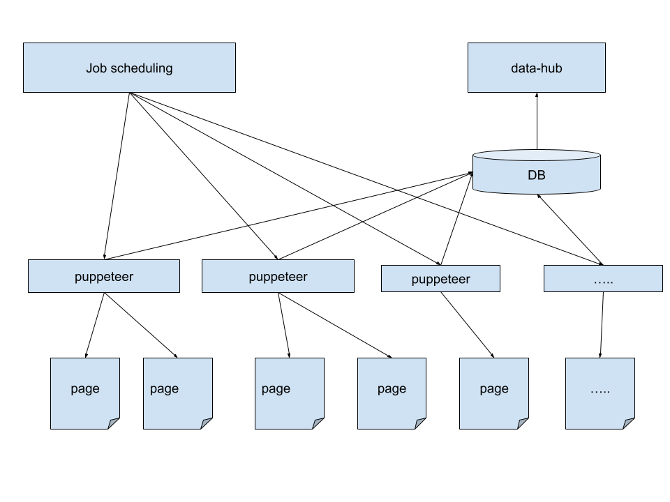

# Fetcher

1. Job scheduling - agenda
   - used to schedule the workers
   
2. data-hub - web-server
   - collect the data and generate a report
   - [https://github.com/chet-cloud/fetch_data_hub](https://github.com/chet-cloud/fetch_data_hub)
   
3. workers - Puppeteer
   - developer create many fetching scripts for puppeteer in a UI development environment. After the scripts pass the test, they will be running in a headless environment. 
   - fetch the data from pages and save the data to DB
   - [https://github.com/chet-cloud/fetch_worker.git](https://github.com/chet-cloud/fetch_worker.git) 

Fetcher is not a crawler but uses similar ways to get the data. The fetching process and the data display are separated, running automatic as services.

# Tasks

1. fetch instagram comments data in a post 
2. fetch followers by given some username

# Deployment

1. todo

## TODOS
- [x] create starter project for worker and data-hub, can be used to log in and fetch the comments
- [ ] create no-vnc docker image for development environment
- [ ] integrate the job scheduling and data-hub into one web-server project