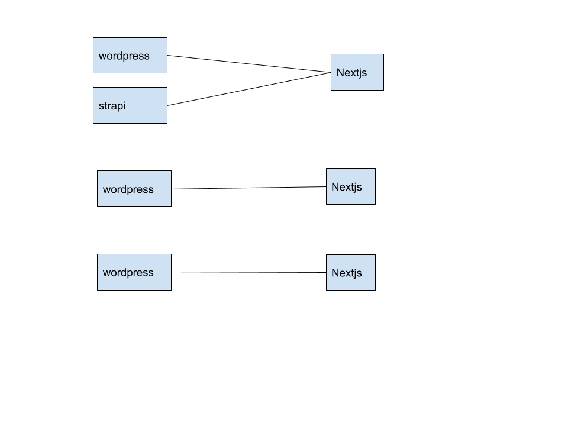
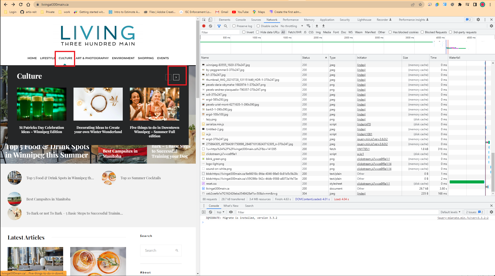

# Artisreit improvement solutions for wordpress website

The most important things that WordPress provides for us is the `content management` and `appearance`.

## 1. Bridge solution

WordPress become an offline content manager. Nextjs is responsible for the appearance. This solution bring WordPress to the static world with Next.js
1. WordPress websites are not live websites and there are no security problems.
2. Need to develop themes for the content in nextjs, can't use the appearance of wordpress.
3. Click public button of the wordpress to trigger the building static website.
4. Except for update the domain from php to static websites, don't need update anything.
5. This is a template for developing appearance pages with nextjs
`https://github.com/chet-cloud/next-wordpress-starter`
6. it's possible to develop nextjs themes crossing all the wordpress, because the api and database structure is fixed

## 2. Static solution
Fetch the wordpress pages and save them to static pages. Server the static pages under a domain. This solution keeps the content management and appearance of wordpress and builds static pages. it seems like a perfect solution, but there are some problems - how to generate perfect static websites.

### Concept
1. URL
   
   `user request a page with a url, like https://artisreit.com/cc/ff`

2. state
   
   `when browser opens a url, there is a state in the browser. when user takes action (For example, scrolling down pages, clicking a loading more button), the state will changes according to the pages`

3. static items
   
   `when the state changes, the state need data from server. we named the data  - static items. static items contains:`

   - html files, css, js, images, and other static files
   - ajax request data, like json file, HTML fragments, any dynamic data generated by php

In the views of users, if a php website is made of many URLs, the aim of Static solution is recording all static items to files and server them in another service.

### An Example
1. open https://livingat300main.ca/, the url is https://livingat300main.ca/
- 

2. click the navigate menu and click button to load more data
-  

3. scroll the page to the bottom
-   

4. click the load more button to load more data
- 

5. disable data committing - disable comment and form commit.
- 

`we know that it's not possible to generate the perfect pages in WordPress because WP didn't support generating static items natively. so the plugin - simple static can't work perfectly. Ann can prove it. The only way to generate the perfect static items is by crawling some URLs and simulating all the possible user actions and recording all the traffic data.`

### How to implement

1. second domain

   `There is a domain named: artisreit-mg.net resoved to the web application (artisreit.com). The second domain (artisreit-mg.net) will be the entry to manage the wordpress. The first domain - artisreit.com will be resovled to a directory in CDN. The directory contains all the static items for the web application (artisreit.com)`

2. static helper plugin

    `this plugin expose a api to export all the URL of the wordpress`

3. Static service
   
   `when user clicks publish button, the wordpress request the static service and the static service trigger a building task`

   - fetching the api data to get all URLS from some wordpress
   - set up a chrome environment open one url in static service
   - simulate scroll and click actions
   - recording all the trafic data and save them to files
  
4. preview the static items
   
   `the static website can be preview by manager and make sure all pages are perfect`

5. deploy static items to CDN
   
   `when all URLs are opened and all the data are fully loaded and saved, then send the static items to CDN`

#### problems

- 

- 

1. every URL need a script. The script need to be developed and tested to make sure all the state of the pages can be recorded.
   
   `there are 195 urls for livingat300main, however, the same post type share the same page structure. If there are 4 types of post, there will be 4 script for all URL`

2. Except for simulating the user click and scroll action, the script need to remove the comment and other form in the pages.

3. Make sure the whole fetching process didn't take too much time and not too error-prone.

4. When wordpress changed the theme, the fetching script need to be updated according to the new page structure.

5. Most of the static items are in wp-content and wp-includes. we can mount these 2 direcotris to the storage of CDN. we need to talk about the mount topic with Eric.

6. Uploading images via WordPress is easy, but the wordpress directory will become harder to maintainning. There should be a unified file manager. and all files will be put in CDN by the file manager. 
   
   `I believe this is the first step to decoulp from wordpress for the future.` 

## 3. Gateway solution

The traffic goes through the gateway to PHP runtime, PHP renders the content that goes back to user by gateway
the gateway is the place where we can:
1. monitor traffic
2. Parse traffic
3. route URL
4. Cache request content 
   
   `For example, when use request http://artisreit.com/xxx/, gateway forwareds the request to php, and save the response in redis. when second request to http://artisreit.com/xxx/, the gateway response the content from redis not from php. when manager update the page (http://artisreit.com/xxx/), the page cached in redis will be removed`

5. Protect URLs
   
   `we can have some rules to prevent the public visit wp-admin`

6. Authenticate user request

### There are 2 ways to deploy gateway.

* One global gateway.
  - it's global controller which manage all the traffic
  - need the wordpress deployed in VM, not in web application container
  

* Every wordpress instance in web application container has a gateway
  - all gateways combine to a mesh 
  - it's easy to deploy in our current wordpress application.
  

### production for this solution
1. [treafic](https://traefik.io/traefik/)
2. [kong](https://konghq.com/install#kong-community)
3. [nginx](https://www.nginx.com/)

I prefer treafic, which support plugin, or develop our own gateway app. we can custom all the features we want
1. security
   - only allow the managers to visit the manager pages by IP or token. reduce the security problems
   - ban all update operation url request
2. performance
   - cache the php rendered pages in redis. (the cache is static pages, they are in memery not in CDN)
3. one command to deploy it to the azure php environment, don't need change anything.

# conclusion

