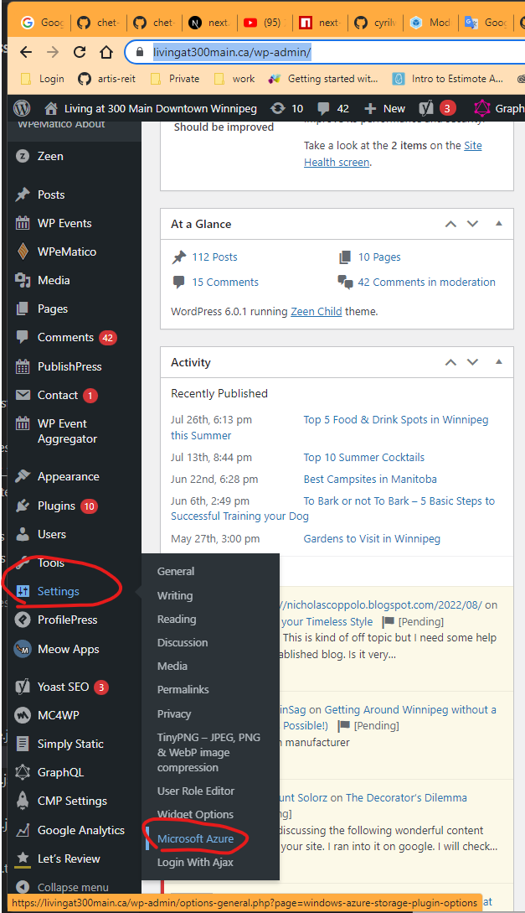
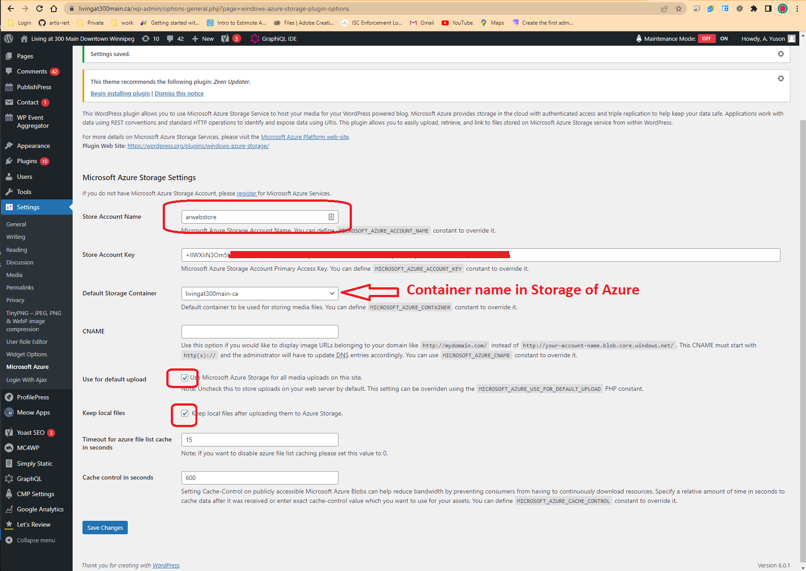
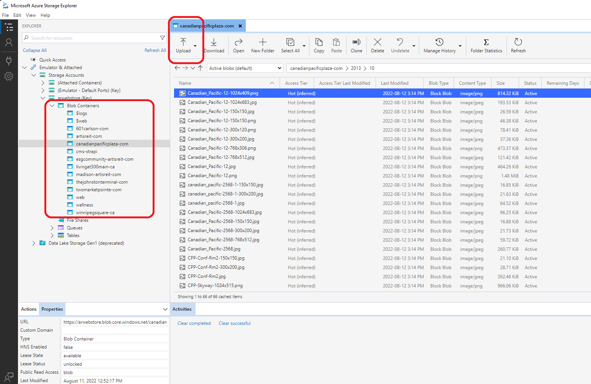

# migrate media files of Wordpress from local disk to CDN

1. install the plugin and activate it  - [windows-azure-storage](https://wordpress.org/plugins/windows-azure-storage/)
   
2. config the plugin
   - 
   - 

3. install and run scp as a window service - [win-service-winscp](https://github.com/chet-cloud/win-service-winscp)
   
    ```shell
    # Clone the proejct into c:/
    git clone https://github.com/chet-cloud/win-service-winscp.git c:/winscp

    # update the script.txt with the ftp_username, ftp_password and ftp_url

    # livingat300main-ca
    open ftps://{ftp_username}:{ftp_password}@{ftp_url}/
    synchronize local -delete C:\Sync\livingat300main-ca ./site/wwwroot/wp-content/uploads
    # winnipegsquare-com
    open ftps://{ftp_username}:{ftp_password}@{ftp_url}/
    synchronize local -delete C:\Sync\winnipegsquare-com ./site/wwwroot/wp-content/uploads
    # artisreit-com
    open ftps://{ftp_username}:{ftp_password}@{ftp_url}/
    synchronize local -delete C:\Sync\artisreit-com ./site/wwwroot/wp-content/uploads
    # madison-artisreit-com
    open ftps://{ftp_username}:{ftp_password}@{ftp_url}/
    synchronize local -delete C:\Sync\madison-artisreit-com ./site/wwwroot/wp-content/uploads
    # canadianpacificplaza-com 
    open ftps://{ftp_username}:{ftp_password}@{ftp_url}/
    synchronize local -delete C:\Sync\canadianpacificplaza-com ./site/wwwroot/wp-content/uploads
    # esgcommunity-artisreit-com
    open ftps://{ftp_username}:{ftp_password}@{ftp_url}/
    synchronize local -delete C:\Sync\esgcommunity-artisreit-com ./site/wwwroot/wp-content/uploads
    # 601carlson-com
    open ftps://{ftp_username}:{ftp_password}@{ftp_url}/
    synchronize local -delete C:\Sync\601carlson-com ./site/wwwroot/wp-content/uploads
    # thejohnstonterminal-com
    open ftps://{ftp_username}:{ftp_password}@{ftp_url}/
    synchronize local -delete C:\Sync\thejohnstonterminal-com ./site/wwwroot/wp-content/uploads
    # twomarketpointe-com
    open ftps://{ftp_username}:{ftp_password}@{ftp_url}/
    synchronize local -delete C:\Sync\twomarketpointe-com ./site/wwwroot/wp-content/uploads

    exit

    # run the following commands, then wait 24 hours, the files in the ftps will copy to the local directory C:\Sync
    winscp-service install
    winscp-service start

    ```
    
4. install Azure Storage Explorer - [storage-explorer](https://azure.microsoft.com/en-us/products/storage/storage-explorer/)

5. create the containers in storage and upload the media files to CDN
   - 

6. upload the `upload_url_path` in options table 

    ```sql
    -- https://arwebstore.blob.core.windows.net/601carlson-com
    SELECT * FROM wp_options where option_name = "upload_url_path";
    UPDATE `wp_options` SET `option_value` = 'https://arwebstore.blob.core.windows.net/601carlson-com' where option_name = "upload_url_path";

    -- https://www.artisreit.com/wp-content/uploads
    -- https://arwebstore.blob.core.windows.net/artisreit-com
    SELECT * FROM wp_options where option_name = "upload_url_path";
    UPDATE `wp_options` SET `option_value` = 'https://arwebstore.blob.core.windows.net/artisreit-com' where option_name = "upload_url_path";

    -- https://arwebstore.blob.core.windows.net/madison-artisreit-com 
    SELECT * FROM vnt_options where option_name = "upload_url_path";
    UPDATE `vnt_options` SET `option_value` = 'https://arwebstore.blob.core.windows.net/artisreit-com' where option_name = "upload_url_path";

    -- https://arwebstore.blob.core.windows.net/esgcommunity-artisreit-com
    SELECT * FROM wp_options where option_name = "upload_url_path";
    UPDATE `wp_options` SET `option_value` = 'https://arwebstore.blob.core.windows.net/esgcommunity-artisreit-com' where option_name = "upload_url_path";

    -- https://arwebstore.blob.core.windows.net/thejohnstonterminal-com
    SELECT * FROM wp_options where option_name = "upload_url_path";
    UPDATE `wp_options` SET `option_value` = 'https://arwebstore.blob.core.windows.net/thejohnstonterminal-com' where option_name = "upload_url_path";

    -- https://arwebstore.blob.core.windows.net/winnipegsquare-ca
    SELECT * FROM wp_options where option_name = "upload_url_path";
    UPDATE `wp_options` SET `option_value` = 'https://arwebstore.blob.core.windows.net/winnipegsquare-ca' where option_name = "upload_url_path";


    -- https://arwebstore.blob.core.windows.net/canadianpacificplaza-com 
    SELECT * FROM wp_options where option_name = "upload_url_path";
    UPDATE `wp_options` SET `option_value` = 'https://arwebstore.blob.core.windows.net/canadianpacificplaza-com' where option_name = "upload_url_path";

    -- https://arwebstore.blob.core.windows.net/twomarketpointe-com
    SELECT * FROM wp_options where option_name = "upload_url_path";
    UPDATE `wp_options` SET `option_value` = 'https://arwebstore.blob.core.windows.net/twomarketpointe-com' where option_name = "upload_url_path";

    ```


