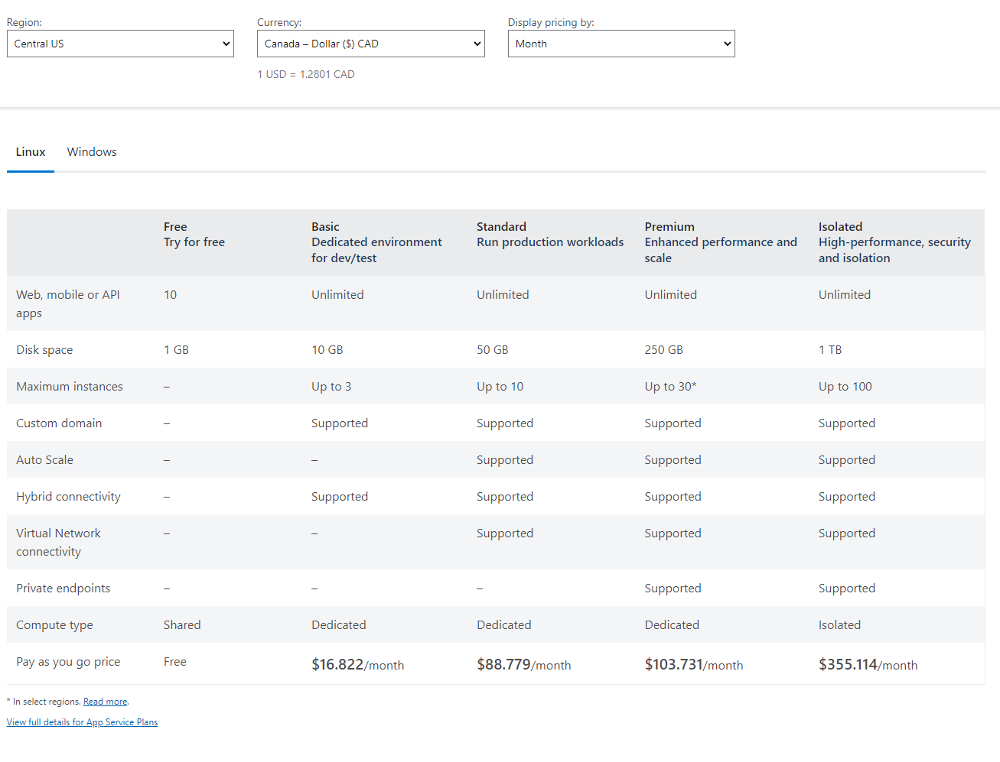
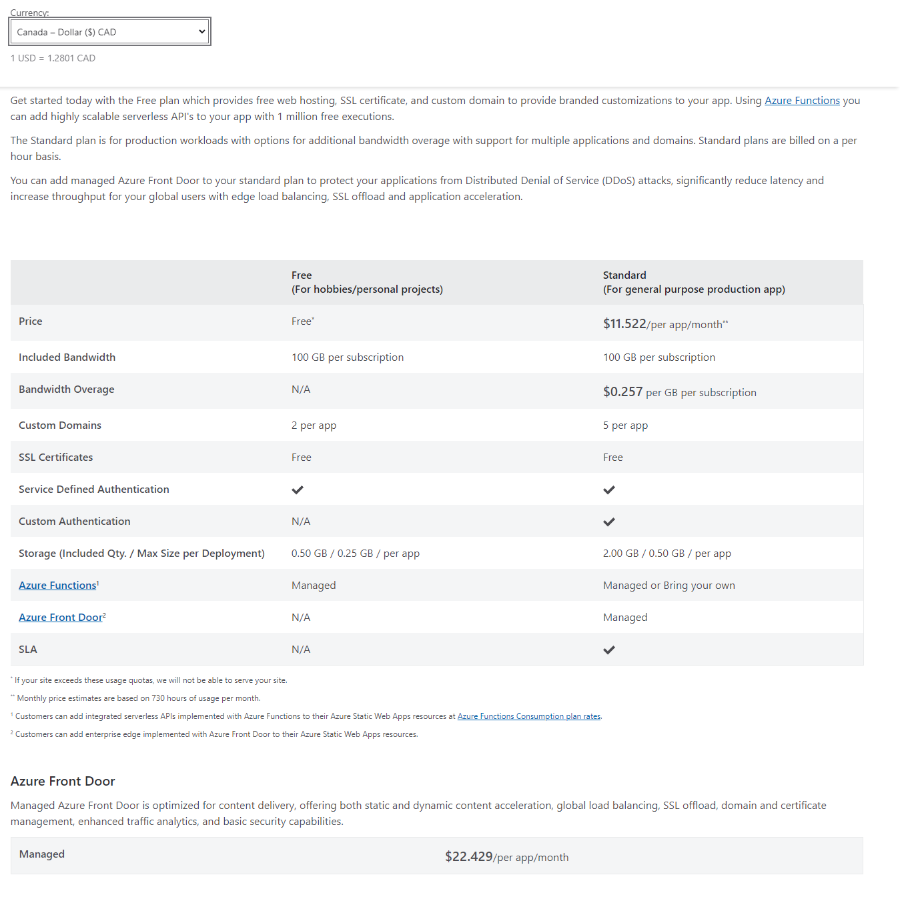
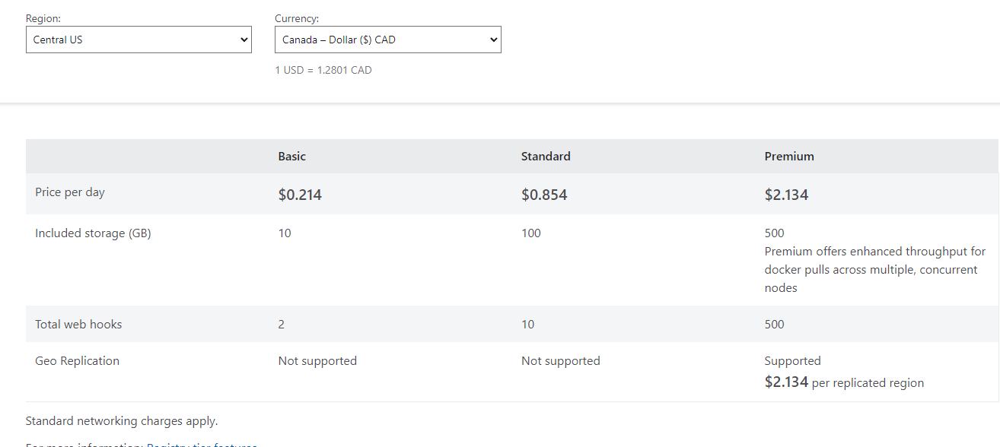
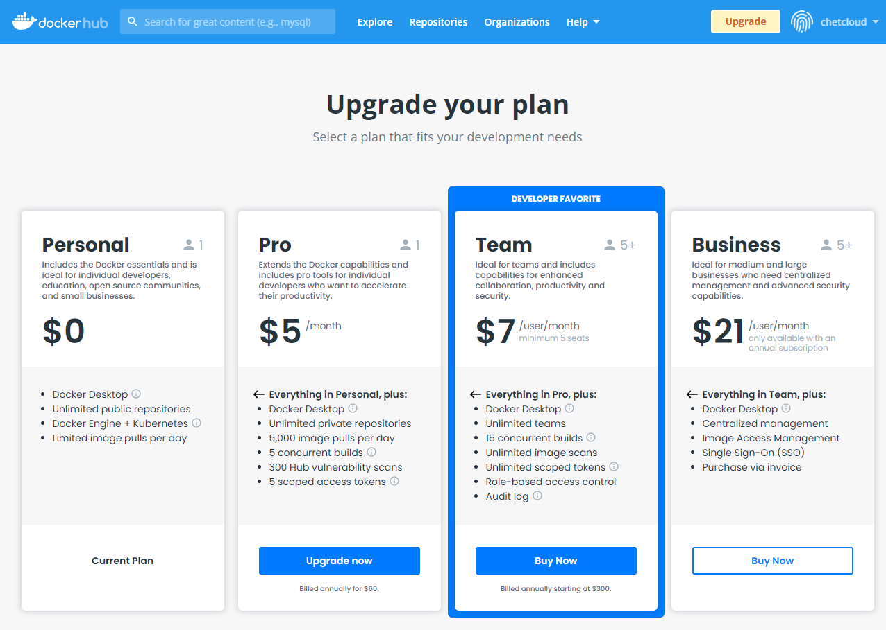
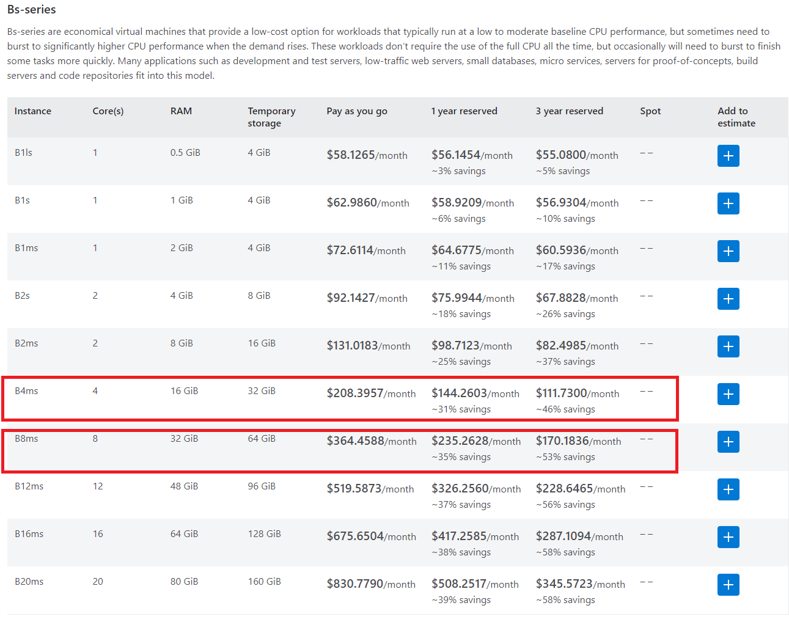

# Azure resource requirement

1. Azure Container Registry

    - Nginx-PHP-wordpress docker image
    - grafana image
    - strapi image

2. Development Environment and Test Environment
    - 16G RAM, 60G or 120G Disk, Ubuntu VM


3. Product database
    - Same as online one


4. Development database
    - Same as online one


5. Azure Static Websites
    - About 25 Azure web static apps, need one by one, not need all immediately (need after converting the websites to static ones).
    - frond door for artisreit.com
    - CDN storage for static resource


6. Azure web server
    - strapi (deployed as docker)
    - monitor service
    - All current online web server apps
    - release playground web server after migration to Ubuntu VM
    - when some php website migrate to static app, this php server can be release


# About cost

1. App Service and static apps Price comparison

    - App Service pricing - [https://azure.microsoft.com/en-ca/pricing/details/app-service/linux/](https://azure.microsoft.com/en-ca/pricing/details/app-service/linux/)
    


    - Static Web Apps pricing
    [https://azure.microsoft.com/en-ca/pricing/details/app-service/static/](https://azure.microsoft.com/en-ca/pricing/details/app-service/static/)
    

    - `About 25 Azure web static apps` is not more extra 25 web static apps, they are new services used to replace the existed App Services.
    As the pictures shows the web static app is cheaper than app service.
    That means the migration (from current app services to web static apps) can save money.
    

2. performance from low to hight
    ```shell
        php website in PHP ENV
        html website in PHP ENV
        html website in free static website
        html website in not free static website
    ```

    If cost is an important factor, the free static website is a better choice.


3. Azure Container Registry and dockerhub

    - [Azure Container Registry pricing](https://azure.microsoft.com/en-ca/pricing/details/container-registry/)
    

    - [dockerhub](https://hub.docker.com/billing/plan/update)
    

    - `$5/month pro` in dockerhub is better option for our work if you don't mind using dockerhub. Another choice is we can build a dockerhub in our own ubuntu VM, but we need more ram and more disk space for ubuntu VM.


4. Frond door - $22.5/per app /month we don't need them right now, even we don't need them if we think they are a big burden


# In conclustion

- Option 1: (keep the existed app and service)

    1. Permit to create free static website in azure
    2. one strapi App Service in azure
    3. one monitor App Service in azure
    4. one nginx-docker app service in azure for testing the new Cache enviroment
    5. upgrade the ubuntu VM to 8-cors-32GRAM-64G-Disk Ubuntu VMs in azure (or two 16G RAM, 120G SSD computer towers running ubuntu server in the company office)

    `Cost: 3 App Service + B8ms`

- Option 2:(keep the existed app and service)

    1. Permit to create free static website in azure
    2. one nginx-docker app service in azure for testing the new Cache enviroment
    3. replace the ubuntu VM with two 4-cors-16GRAM-32G-Disk Ubuntu VMs in azure

    `Cost: 2 * B4ms`

Check out `B8ms` and `B4ms` in the following [prices list](https://azure.microsoft.com/en-ca/pricing/details/virtual-machines/ubuntu-advantage-advanced/)

